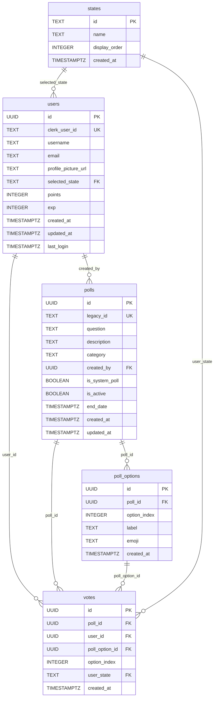

# MyPeta Database Tables

## Entity Relationship Diagram

---

## 1. `states`

Reference table for the 16 Malaysian states/territories.

| Column | Type | Default | Constraints |
|--------|------|---------|-------------|
| `id` | `TEXT` | — | **PRIMARY KEY** |
| `name` | `TEXT` | — | NOT NULL |
| `display_order` | `INTEGER` | `0` | — |
| `created_at` | `TIMESTAMPTZ` | `NOW()` | NOT NULL |

**Notes:**
- IDs are slugified names: `'selangor'`, `'kualalumpur'`, `'negerisembilan'`, etc.
- Referenced by `users.selected_state` and `votes.user_state`
- Pre-seeded with 16 entries (see `04-seed-data.md`)

---

## 2. `users`

User profiles. Created/updated on each Clerk login via `get_or_create_user` RPC.

| Column | Type | Default | Constraints |
|--------|------|---------|-------------|
| `id` | `UUID` | `gen_random_uuid()` | **PRIMARY KEY** |
| `clerk_user_id` | `TEXT` | — | **UNIQUE**, NOT NULL |
| `username` | `TEXT` | — | NULLABLE |
| `email` | `TEXT` | — | NULLABLE |
| `profile_picture_url` | `TEXT` | — | NULLABLE |
| `selected_state` | `TEXT` | — | FK → `states(id)`, NULLABLE |
| `points` | `INTEGER` | `0` | — |
| `exp` | `INTEGER` | `0` | — |
| `created_at` | `TIMESTAMPTZ` | `NOW()` | NOT NULL |
| `updated_at` | `TIMESTAMPTZ` | `NOW()` | NOT NULL |
| `last_login` | `TIMESTAMPTZ` | `NOW()` | NOT NULL |

**Notes:**
- `clerk_user_id` maps to Clerk's `user.id` (e.g., `user_2abc...`)
- `points` and `exp` should never be modified via direct table access — only via RPC functions
- Realtime is enabled on this table for live stats updates
- Gamification: Level = `floor(exp / 1000) + 1`

---

## 3. `polls`

Poll questions and metadata. Can be system-created or user-created.

| Column | Type | Default | Constraints |
|--------|------|---------|-------------|
| `id` | `UUID` | `gen_random_uuid()` | **PRIMARY KEY** |
| `legacy_id` | `TEXT` | — | **UNIQUE**, NULLABLE |
| `question` | `TEXT` | — | NOT NULL |
| `description` | `TEXT` | — | NULLABLE |
| `category` | `TEXT` | — | NOT NULL |
| `created_by` | `UUID` | — | FK → `users(id)`, NULLABLE |
| `is_system_poll` | `BOOLEAN` | `false` | — |
| `is_active` | `BOOLEAN` | `true` | — |
| `end_date` | `TIMESTAMPTZ` | — | NULLABLE |
| `created_at` | `TIMESTAMPTZ` | `NOW()` | NOT NULL |
| `updated_at` | `TIMESTAMPTZ` | `NOW()` | NOT NULL |

**Notes:**
- `category` values: `'food'`, `'politics'`, `'culture'`, `'economy'`, `'social'`
- `legacy_id` maps to the old hardcoded IDs from `data/polls.ts` (e.g., `'nasi-lemak-best'`)
- `created_by` is `NULL` for system/seeded polls
- The app filters by `is_active = true` and orders by `created_at DESC`

---

## 4. `poll_options`

Answer choices for each poll.

| Column | Type | Default | Constraints |
|--------|------|---------|-------------|
| `id` | `UUID` | `gen_random_uuid()` | **PRIMARY KEY** |
| `poll_id` | `UUID` | — | FK → `polls(id)` ON DELETE CASCADE |
| `option_index` | `INTEGER` | — | NOT NULL |
| `label` | `TEXT` | — | NOT NULL |
| `emoji` | `TEXT` | — | NOT NULL |
| `created_at` | `TIMESTAMPTZ` | `NOW()` | NOT NULL |

**Unique constraint:** `(poll_id, option_index)`

**Notes:**
- Most polls have exactly 2 options (index 0 and 1)
- The UI renders a special "split bar" for 2-option polls and falls back to card-style for 3+
- `emoji` is displayed alongside the label (e.g., `'🇲🇾'`, `'🌍'`)

---

## 5. `votes`

Individual vote records. One vote per user per poll.

| Column | Type | Default | Constraints |
|--------|------|---------|-------------|
| `id` | `UUID` | `gen_random_uuid()` | **PRIMARY KEY** |
| `poll_id` | `UUID` | — | FK → `polls(id)` ON DELETE CASCADE |
| `user_id` | `UUID` | — | FK → `users(id)` ON DELETE CASCADE |
| `poll_option_id` | `UUID` | — | FK → `poll_options(id)` ON DELETE CASCADE |
| `option_index` | `INTEGER` | — | NOT NULL |
| `user_state` | `TEXT` | — | FK → `states(id)` |
| `created_at` | `TIMESTAMPTZ` | `NOW()` | NOT NULL |

**Unique constraint:** `(poll_id, user_id)` — prevents double voting

**Notes:**
- `option_index` is denormalized (also exists in `poll_options`) for faster aggregation
- `user_state` captures the user's state at vote time for analytics/breakdown charts
- The app loads user votes via: `SELECT poll_id, option_index, user_state, created_at FROM votes WHERE user_id = ?`
